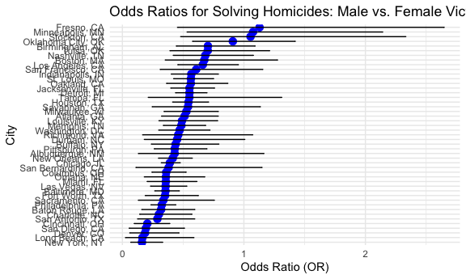

Homework 6
================

Load key packages

``` r
library(broom)
library(modelr)
```

    ## 
    ## Attaching package: 'modelr'

    ## The following object is masked from 'package:broom':
    ## 
    ##     bootstrap

``` r
library(purrr)
```

# Problem 2

``` r
homicide_data = read.csv(file = "./data/homicide-data.csv") |> 
  janitor::clean_names() |> 
  mutate(
    city_state = paste(city, state, sep = ", "),
    victim_age = as.numeric(victim_age),
    victim_age = ifelse(is.na(victim_age), NA_real_, victim_age)) |> 
  select(victim_race, victim_age, victim_sex, disposition, city_state) |> 
  filter(
    victim_race %in% c("White", "Black"),
    !city_state %in% c("Dallas, TX", "Phoenix, AZ", "Kansas City, MO,", "Tulsa, AL"))
```

``` r
baltimore_data = homicide_data |> 
  filter(city_state == "Baltimore, MD")

baltimore_logistic = glm(
  disposition %in% c("Closed by arrest", "Closed without arrest") ~ victim_age + victim_sex + victim_race, family = binomial(), data = baltimore_data
)

summary(baltimore_logistic)
```

    ## 
    ## Call:
    ## glm(formula = disposition %in% c("Closed by arrest", "Closed without arrest") ~ 
    ##     victim_age + victim_sex + victim_race, family = binomial(), 
    ##     data = baltimore_data)
    ## 
    ## Coefficients:
    ##                   Estimate Std. Error z value Pr(>|z|)    
    ## (Intercept)       0.663792   0.174495   3.804 0.000142 ***
    ## victim_age       -0.005205   0.003255  -1.599 0.109790    
    ## victim_sexMale   -1.036564   0.142689  -7.264 3.74e-13 ***
    ## victim_raceWhite  0.899714   0.180304   4.990 6.04e-07 ***
    ## ---
    ## Signif. codes:  0 '***' 0.001 '**' 0.01 '*' 0.05 '.' 0.1 ' ' 1
    ## 
    ## (Dispersion parameter for binomial family taken to be 1)
    ## 
    ##     Null deviance: 3716.5  on 2752  degrees of freedom
    ## Residual deviance: 3619.5  on 2749  degrees of freedom
    ## AIC: 3627.5
    ## 
    ## Number of Fisher Scoring iterations: 4

``` r
tidy_model = tidy(baltimore_logistic, conf.int = TRUE)
```

``` r
sex_coef = tidy_model |> 
  filter(term == "victim_sexMale")
```

``` r
odds_ratio = exp(sex_coef$estimate)
confidence_upper = exp(sex_coef$conf.high)
confidence_lower = exp(sex_coef$conf.low)
```

``` r
results = homicide_data |> 
  filter(victim_race %in% c("White", "Black")) |> 
  group_by(city_state) |> 
  nest() |> 
  mutate(
    model = map(data, ~ glm(disposition %in% c("Closed by arrest", "Closed without arrest") ~ victim_age + victim_sex + victim_race, data = .x, family = binomial())),
    tidy_model = map(model, tidy, conf.int = TRUE)) |> 
  select(city_state, tidy_model)
```

``` r
results = results |> 
  unnest(tidy_model) |> 
  filter(term == "victim_sexMale") |> 
  mutate(
    odds_ratio = exp(estimate),
    confidence_lower = exp(conf.low),
    confidence_upper = exp(conf.high)
  ) |> 
  filter(!is.na(odds_ratio) & !is.na(confidence_lower) & !is.na(confidence_upper))
```

``` r
ggplot(results, aes(x = odds_ratio, y = reorder(city_state, odds_ratio))) +
  geom_point(size = 3, color = "blue") +
  geom_errorbarh(aes(xmin = confidence_lower, xmax= confidence_upper), height = 0.2, color = "black") +
  labs(
    title = "Odds Ratios for Solving Homicides: Male vs. Female Victims",
    x = "Odds Ratio (OR)", 
    y = "City")
```



The plot shows the odds ratio of solved homicide cases, either Closed
with arrest or Closed without arrest, comparing males and females and
across different cities. This is to show how homicide rates differ by
gender and geographic location. The x-axis shows the odds ratio and the
y-axis show the city. It looks like there is a higher odds ratio in
Fresno, CA, Minneapolis, MN, and Stockton, CA.

# Problem 3

``` r
birthweight_data = read.csv(file = "./data/birthweight.csv") |> 
  janitor::clean_names() |> 
  mutate(
    babysex = factor(babysex, levels = c(1, 2), labels = c("Male", "Female")),
    frace = factor(frace, levels = c(1, 2, 3, 4, 8, 9), labels = c("White", "Black", "Asian", "Puerto Rican", "Other", "Unknown")),
    malform = factor(malform, levels = c(0, 1), labels = c("Absent", "Present")),
    mrace = factor(mrace, levels = c(1, 2, 3, 4, 8), labels = c("White", "Black", "Asian", "Puerto Rican", "Other"))
  )
```

``` r
missing_data = colSums(is.na(birthweight_data))
print(missing_data)
```

    ##  babysex    bhead  blength      bwt    delwt  fincome    frace  gaweeks 
    ##        0        0        0        0        0        0        0        0 
    ##  malform menarche  mheight   momage    mrace   parity  pnumlbw  pnumsga 
    ##        0        0        0        0        0        0        0        0 
    ##    ppbmi     ppwt   smoken   wtgain 
    ##        0        0        0        0

``` r
birthweight_model = lm(
  bwt ~ blength + bhead + babysex + momage + ppbmi + smoken + wtgain + gaweeks + malform + fincome, 
  data = birthweight_data
)
```

The modeling process includes first importing and cleaning the data. I
converted numeric vectors to factor vectors for babysex, frace, malform,
and mrace, and checked for any missing data. I then introduced a
regression model for birthweight factoring in baby’s length at birth in
centimeters, baby’s head circumference at birth in centimeters, baby’s
sex, mother’s age at delivery, mother’s pre-pregnancy BMI, average
number of cigarettes smoked per day during pregnancy, mother’s weight
gain during pregnancy in pounds, gestational age in weeks, presence of
maformations that could affect weight, and family mothly income in
hundreds.

``` r
birthweight_data = birthweight_data |> 
  add_predictions(birthweight_model, var = "predicted_bwt") |> 
  add_residuals(birthweight_model, var = "residual_bwt")
```

``` r
ggplot(birthweight_data, aes(x = predicted_bwt, y = bwt)) + 
  geom_point(alpha = 0.6) +
  geom_abline(slope = 1, intercept = 0, color = "red", linetype = "dashed") +
  labs(
    title = "Actual vs. Predicted Birthweight", 
    x = "Predicted Birthweight (grams)",
    y = "Actual Birthweight (grams)"
  )
```


``` r
ggplot(birthweight_data, aes(x = predicted_bwt, y = residual_bwt)) +
  geom_point(alpha = 0.6) +
  geom_hline(yintercept = 0, color = "red", linetype = "dashed") +
  labs(
    title = "Residuals vs. Predicted Birthweight",
    x = "Predicted Birthweight (grams)",
    y = "Residuals (grams)"
  )
```


``` r
summary(birthweight_model)
```

    ## 
    ## Call:
    ## lm(formula = bwt ~ blength + bhead + babysex + momage + ppbmi + 
    ##     smoken + wtgain + gaweeks + malform + fincome, data = birthweight_data)
    ## 
    ## Residuals:
    ##      Min       1Q   Median       3Q      Max 
    ## -1081.90  -189.08    -4.95   175.43  2578.86 
    ## 
    ## Coefficients:
    ##                  Estimate Std. Error t value Pr(>|t|)    
    ## (Intercept)    -6211.7452    99.5062 -62.426  < 2e-16 ***
    ## blength           79.3276     2.0516  38.665  < 2e-16 ***
    ## bhead            134.8509     3.5230  38.278  < 2e-16 ***
    ## babysexFemale     33.7703     8.6733   3.894 0.000100 ***
    ## momage             4.9812     1.1762   4.235 2.33e-05 ***
    ## ppbmi              5.1263     1.3571   3.777 0.000161 ***
    ## smoken            -2.5406     0.5805  -4.376 1.24e-05 ***
    ## wtgain             4.0640     0.4046  10.045  < 2e-16 ***
    ## gaweeks           12.2857     1.4966   8.209 2.91e-16 ***
    ## malformPresent    27.0994    72.5138   0.374 0.708636    
    ## fincome            1.1316     0.1743   6.493 9.37e-11 ***
    ## ---
    ## Signif. codes:  0 '***' 0.001 '**' 0.01 '*' 0.05 '.' 0.1 ' ' 1
    ## 
    ## Residual standard error: 279.9 on 4331 degrees of freedom
    ## Multiple R-squared:  0.702,  Adjusted R-squared:  0.7013 
    ## F-statistic:  1020 on 10 and 4331 DF,  p-value: < 2.2e-16

``` r
simplified_model = lm(
  bwt ~ blength + gaweeks, 
  data = birthweight_data
)

summary(simplified_model)
```

    ## 
    ## Call:
    ## lm(formula = bwt ~ blength + gaweeks, data = birthweight_data)
    ## 
    ## Residuals:
    ##     Min      1Q  Median      3Q     Max 
    ## -1709.6  -215.4   -11.4   208.2  4188.8 
    ## 
    ## Coefficients:
    ##              Estimate Std. Error t value Pr(>|t|)    
    ## (Intercept) -4347.667     97.958  -44.38   <2e-16 ***
    ## blength       128.556      1.990   64.60   <2e-16 ***
    ## gaweeks        27.047      1.718   15.74   <2e-16 ***
    ## ---
    ## Signif. codes:  0 '***' 0.001 '**' 0.01 '*' 0.05 '.' 0.1 ' ' 1
    ## 
    ## Residual standard error: 333.2 on 4339 degrees of freedom
    ## Multiple R-squared:  0.5769, Adjusted R-squared:  0.5767 
    ## F-statistic:  2958 on 2 and 4339 DF,  p-value: < 2.2e-16

``` r
interaction_model = lm(
  bwt ~ bhead * blength * babysex,
  data = birthweight_data
)

summary(interaction_model)
```

    ## 
    ## Call:
    ## lm(formula = bwt ~ bhead * blength * babysex, data = birthweight_data)
    ## 
    ## Residuals:
    ##      Min       1Q   Median       3Q      Max 
    ## -1132.99  -190.42   -10.33   178.63  2617.96 
    ## 
    ## Coefficients:
    ##                               Estimate Std. Error t value Pr(>|t|)    
    ## (Intercept)                 -7176.8170  1264.8397  -5.674 1.49e-08 ***
    ## bhead                         181.7956    38.0542   4.777 1.84e-06 ***
    ## blength                       102.1269    26.2118   3.896 9.92e-05 ***
    ## babysexFemale                6374.8684  1677.7669   3.800 0.000147 ***
    ## bhead:blength                  -0.5536     0.7802  -0.710 0.478012    
    ## bhead:babysexFemale          -198.3932    51.0917  -3.883 0.000105 ***
    ## blength:babysexFemale        -123.7729    35.1185  -3.524 0.000429 ***
    ## bhead:blength:babysexFemale     3.8781     1.0566   3.670 0.000245 ***
    ## ---
    ## Signif. codes:  0 '***' 0.001 '**' 0.01 '*' 0.05 '.' 0.1 ' ' 1
    ## 
    ## Residual standard error: 287.7 on 4334 degrees of freedom
    ## Multiple R-squared:  0.6849, Adjusted R-squared:  0.6844 
    ## F-statistic:  1346 on 7 and 4334 DF,  p-value: < 2.2e-16

``` r
k_folds = 10

set.seed(123)
indices = sample(1:nrow(birthweight_data))
folds = split(indices, cut(1:length(indices), k_folds, labels = FALSE))
```

``` r
full_model = function(train_data) {
  lm(bwt ~ blength + bhead + babysex + momage + ppbmi + smoken + wtgain + gaweeks + malform + fincome, data = train_data)
}

simplified_model = function(train_data) {
  lm(bwt ~ blength + gaweeks, data = train_data)
}

interaction_model = function(train_data) {
  lm(bwt ~ bhead * blength * babysex, data = train_data)
}
```

``` r
calc_rmse = function(model_func, fold_idx) {
  test_indices = folds[[fold_idx]]
  train_data = birthweight_data[-test_indices, ]
  test_data = birthweight_data[test_indices, ]
  
  model = model_func(train_data)
  
  predictions = predict(model, newdata = test_data)
  
  rmse = sqrt(mean((test_data$bwt - predictions)^2))
  
  return(rmse)
}
```

``` r
full_model_rmse = map_dbl(1:k_folds, ~ calc_rmse(full_model, .))

simplified_model_rmse = map_dbl(1:k_folds, ~ calc_rmse(simplified_model, .))

interaction_model_rmse = map_dbl(1:k_folds, ~ calc_rmse(interaction_model, .))
```

``` r
model_comparison = tibble(
  model = c("Full Model", "Simplified Model", "Interaction Model"),
  mean_rmse = c(mean(full_model_rmse), mean(simplified_model_rmse), mean(interaction_model_rmse)),
  sd_rmse = c(sd(full_model_rmse), sd(simplified_model_rmse), mean(interaction_model_rmse))
)

print(model_comparison)
```

    ## # A tibble: 3 × 3
    ##   model             mean_rmse sd_rmse
    ##   <chr>                 <dbl>   <dbl>
    ## 1 Full Model             281.    12.2
    ## 2 Simplified Model       333.    22.6
    ## 3 Interaction Model      289.   289.
